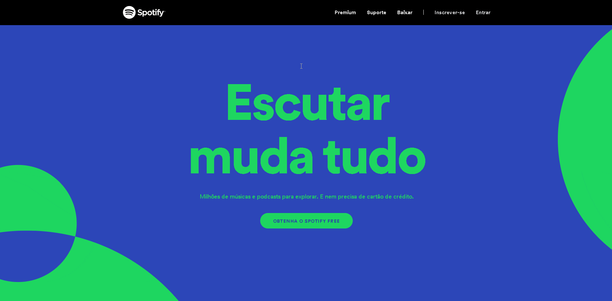
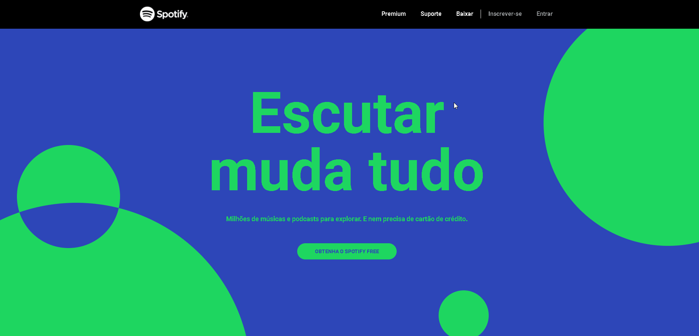

<h1 align="center">
 
  
 
  
 Spotify UI Clone
</h1>

 

##  **<h2  align="center"> Aplicação front end 📟 👨‍💻 </h2>**

## 
 <h2 align="center">Um clone da landing page do [Spotify](https://www.spotify.com/br/) utilizando [TailwindCSS](https://tailwindcss.com/docs)</h2> 

# **Site oficial do Spotify** 💻

  

 

# **Aplicação Web - Clone** 💻

  

## 🚀 Tecnologias utilizadas:

 ## **
Iniciando a caminhada para poder participar da maratona nesse mundo da programação 🏃‍
**

 ### 
 <h2 align="center"> Mais uma aplicação realizada por Matheus da Cruz 👨‍💻 </h2> 

